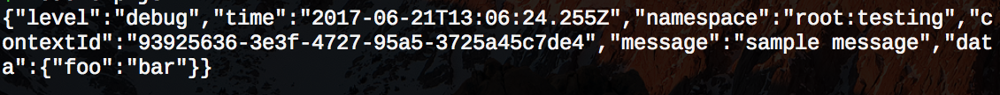
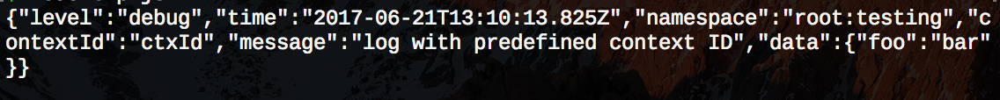
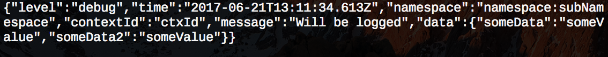
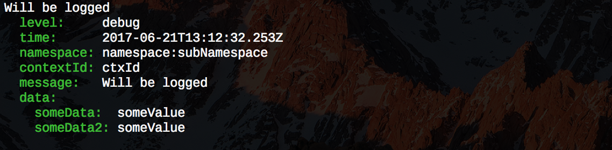
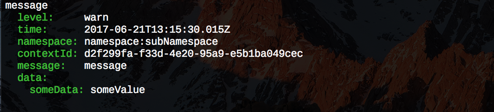
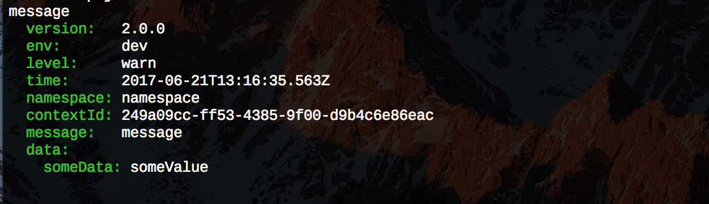

# @ekino/logger

[![NPM version][npm-image]][npm-url]
[![Travis CI][travis-image]][travis-url]
[![Coverage Status][coverage-image]][coverage-url]
[![styled with prettier][prettier-image]][prettier-url]

A Lightweight logger that combines debug namespacing capabilities with winston levels and multioutput

- [Installation](#installation)
- [Usage](#usage)
    - [Using context ID](#using-context-id)
    - [Using namespaces](#using-namespaces)
    - [Outputs](#outputs)
    - [Metadata](#metadata)

## Installation

Using npm:

``` sh
npm install @ekino/logger
```

Or yarn:

``` sh
yarn add @ekino/logger
```

## Usage

By default, the logger output warn and error levels for all namespaces.
You have the ability to set another global log `level` and/or add overrides per `namespace.

A log instance is bounded to a namespace. To use it, instantiate a logger with a namespace and call a log function.

There are 5 available log levels by a priority. When you set a log level, all levels over it are enabled too.
Log level can be set by calling `setLevel` function. 

For example, enabling `info` will enable `info`, `warn` and `error` but not `debug` or `trace`.
The "special" log level `none` means no log and can only be used to set a namespace level.
``` js
{ trace: 0, debug: 1, info: 2, warn: 3, error: 4 }
```

The basic log function signature is
```js
my_log.the_level(message, data) // With data an object holding informations usefull for debug purpose
```

Example

``` javascript
    const logger = require('@ekino/logger')

    logger.setNamespaces('root:*')
    logger.setLevel('debug')

    const log = logger('root:testing')
    log.debug('sample message', {
        foo: 'bar',
    })
```
output : 



### Using context ID

One of the main complexity working with node is ability to follow all logs attached to one call or one function.
This is not mandatory, but based on our experience, we recommmend as a best practice to add a unique identifier that will be passed all along functions calls.
When you log something, you can provide this id as a first parameter and logger will log it. If not provided, it's auto generated.

The signature of the function with contextId is : 
```js
    my_log.the_level(contextId, message, data)
```

Example app.js

``` javascript
    const logger = require('@ekino/logger')
    
    logger.setNamespaces('root:*')
    logger.setLevel('debug')
    
    const log = logger('root:testing')
    log.debug('ctxId', 'log with predefined context ID', {
        foo: 'bar',
    })
```
output : 



### Using namespaces

Logger relies on namespaces. When you want to log something, you should define a namespace that is bound to it.
When you debug, this gives you the flexibility to enable only the namespaces you need to output.
As a good practice, we recommend setting a namespace by folder / file. 
For example for a file in modules/login/dao you could define 'modules:login:dao'.
Warning, "=" can't be part of the namespace as it's a reserved symbol.

You can also define a level per namespace. If no level is defined, the default global level is used.
To disable logs of a namespace, you can specify a level `none`
A namespace ':*' means eveything after ':' will be enabled. Namespaces are parsed as regexp.

To define namespace level, you should suffix namespace with "=the_level" 
For example let's say you need to enable all info logs but for debug purpose you need to lower the level 
of the namespace database to `debug`. You could then use : 

``` javascript
    const logger = require('@ekino/logger')
    
    logger.setLevel('info')
    logger.setNamespaces('*,database*=debug,database:redis*=none')
```
#### Using Logging Namespaces

``` js
    const logger = require('@ekino/logger')

    logger.setNamespaces('namespace:*, namespace:mute=none');
    logger.setLevel('debug');
  
    const log = logger('namespace:subNamespace');
    const log2 = logger('namespace:mute');
    log.debug("Will be logged");
    log2.info("Will not be logged");
```

``` js
    const logger = require('@ekino/logger')

    logger.setNamespaces('*, wrongNamespace=none');
    logger.setLevel('debug');
    
    const log = logger('namespace:subNamespace');
    const log2 = logger('wrongNamespace');
    log.debug("Will be logged");
    log2.info("Will not be logged");
```

### Outputs

For now, the logger provides two output type: `pretty` and `json`, default is `json`.

#### JSON

``` js
    const logger = require('@ekino/logger')
      
    logger.setNamespaces('namespace:*');
    logger.setLevel('debug');
    //logger.setOutput('json');
      
    const log = logger('namespace:subNamespace');
    log.debug('ctxId', 'Will be logged',{someData: 'someValue', someData2: 'someValue'});
```
output : 



#### Pretty

Pretty will output a yaml like content.

``` js
    const logger = require('@ekino/logger')
      
   logger.setNamespaces('namespace:*');
   logger.setLevel('debug');
   logger.setOutput('pretty');
   
   const log = logger('namespace:subNamespace');
   log.debug('ctxId', 'Will be logged',{someData: 'someValue', someData2: 'someValue'});
```
output : 



### Log data

Most of the time, a log message is not enough to guess context.
You can append arbitrary data to your logs. 
If you're using some kind of log collector, you'll then be able to extract those values and inject them in elasticsearch for example.

``` js
    const logger = require('@ekino/logger')
      
    logger.setOutput('pretty');
    logger.setNamespaces('namespace:*');
    logger.setLevel('info');
    
    const log = logger('namespace:subNamespace');
    
    log.warn('message', { someData: 'someValue' });
```

output : 



#### Adding global metadata

Sometimes, you need to identify to which version or which application the logs refers to.
To do so, we provide a function to set informations that will be added to the each log at a top level key.

```js
    const logger = require('@ekino/logger')
    
    logger.setOutput('pretty');
    logger.setNamespaces('*');
    logger.setLevel('info');
    logger.setGlobalContext({ version: '2.0.0', env: 'dev' });
    
    const log = logger('namespace');
    
    log.warn('message', { someData: 'someValue' });
```

output : 



[npm-image]: https://img.shields.io/npm/v/@ekino/logger.svg?style=flat-square
[npm-url]: https://www.npmjs.com/package/@ekino/logger
[travis-image]: https://img.shields.io/travis/ekino/node-logger.svg?style=flat-square
[travis-url]: https://travis-ci.org/ekino/node-logger
[prettier-image]: https://img.shields.io/badge/styled_with-prettier-ff69b4.svg?style=flat-square
[prettier-url]: https://github.com/prettier/prettier
[coverage-image]: https://img.shields.io/coveralls/ekino/node-logger/master.svg?style=flat-square
[coverage-url]: https://coveralls.io/github/ekino/node-logger?branch=master